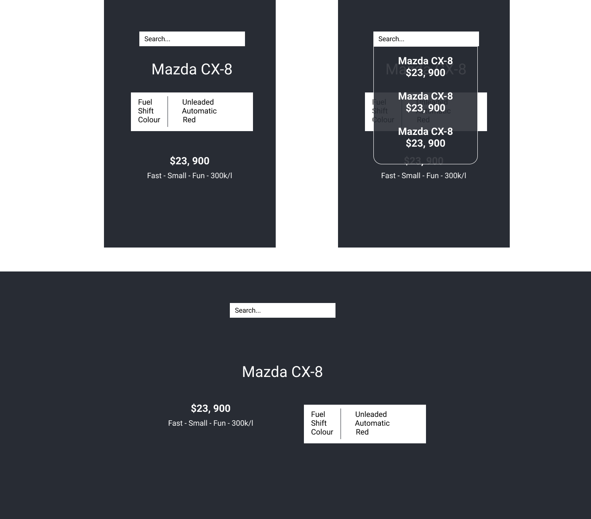

# Displaying cars
## Setup
Run `npm i` to get the dependencies

Run `npm start` to build and serve the application on `localhost:3000`
## Design

## Create a search component
- When the user types into the search box
- It should use the `findCars(searchTerm)` function to display a list of matched cars
- These results should be displayed under the search box

## Show selected car
- When the user clicks on a car in the search box
- It should use the `getCar(make, model)` method to get the full details for the chosen car
- These details should be shown below the search bar in a format similar to that in the designs provided
